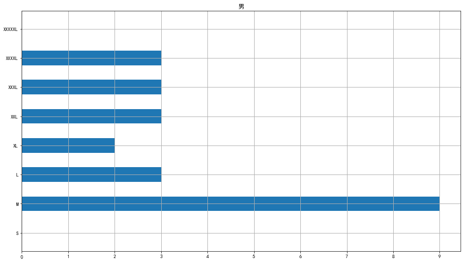
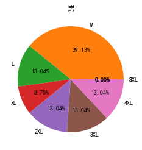
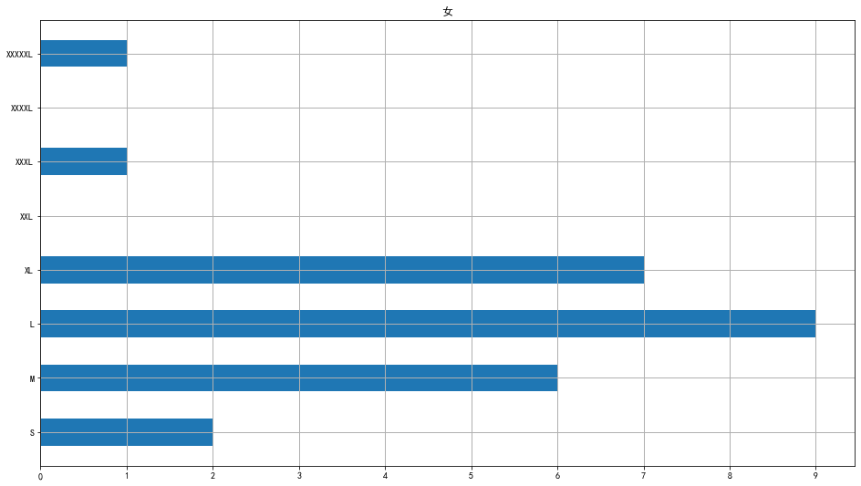
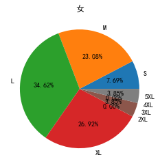

```python
import matplotlib.pyplot as plt
import matplotlib as mtpl
import numpy as np
import warnings
warnings.filterwarnings("ignore")
# 以示例一的数据作图
plt.rcParams['font.sans-serif']=['simhei'] #用来正常显示中文标签
plt.rcParams['axes.unicode_minus']=False #用来正常显示负号
a_1 = ["S","M","L","XL","XXL","XXXL","XXXXL","XXXXXL"]
b_1 =[0,9,3,2,3,3,3,0]
plt.figure(figsize=(16,9))
x_t = range(len(a_1))
plt.title("男")
plt.yticks(x_t,a_1)
plt.grid(b=True, which='both', axis='both', lw=1)
plt.xticks(np.arange(0, 20, 1))
# plt.bar(a,b)
plt.barh(a_1,b_1,height=0.5)
plt.show()

import matplotlib.pyplot as plt
import numpy as np

y = np.array(b_1)

plt.pie(x=y,
        labels=['S','M','L',"XL","2XL","3XL","4XL","5XL"],
        autopct='%.2f%%'
       )
plt.title("男") # 设置标题
plt.show()
```


    

    


    

    


```python
import matplotlib.pyplot as plt
import matplotlib as mtpl
import warnings
warnings.filterwarnings("ignore")
# 以示例一的数据作图
plt.rcParams['font.sans-serif']=['simhei'] #用来正常显示中文标签
plt.rcParams['axes.unicode_minus']=False #用来正常显示负号
a_1 = ["S","M","L","XL","XXL","XXXL","XXXXL","XXXXXL"]
b_1 =[2,6,9,7,0,1,0,1]
plt.figure(figsize=(16,9))
x_t = range(len(a_1))
plt.title("女")
plt.yticks(x_t,a_1)
plt.grid(b=True, which='both', axis='both', lw=1)
plt.xticks(np.arange(0, 12, 1))
# plt.bar(a,b)
plt.barh(a_1,b_1,height=0.5)
plt.show()


import matplotlib.pyplot as plt
import numpy as np

y = np.array(b_1)

plt.pie(x=y,
        labels=['S','M','L',"XL","2XL","3XL","4XL","5XL"], 
        autopct='%.2f%%'
       )
plt.title("女") # 设置标题
plt.show()
```


    

    


    

    

